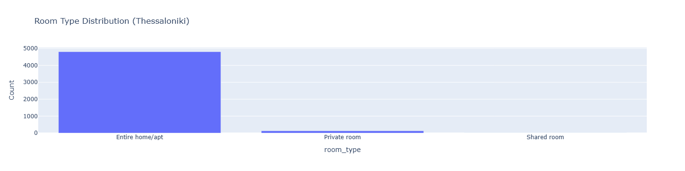
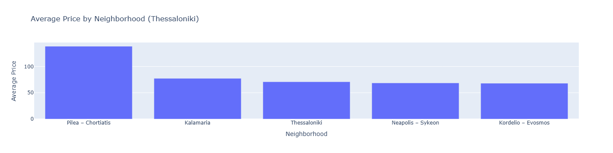
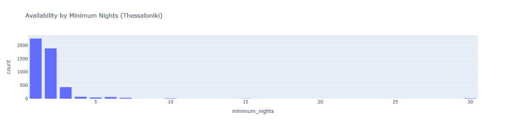
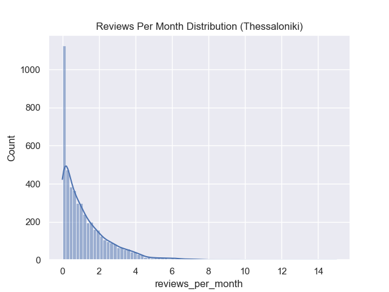
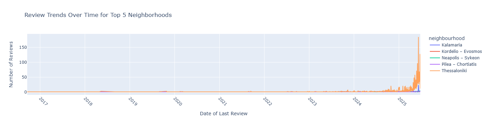
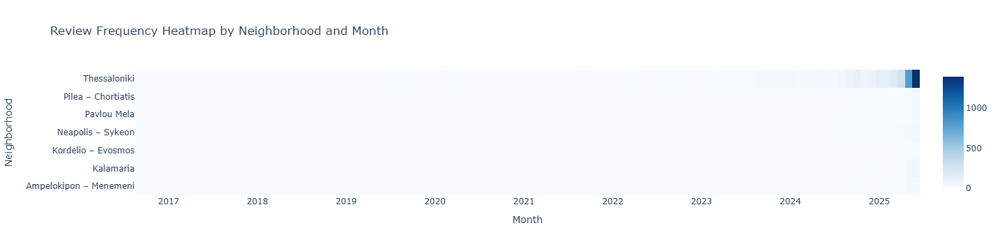

I did an Exploratory Analysis Project using data from the [Inside Airbnb](https://insideairbnb.com/) website.  
I chose two cities in my country (Athens and Thessaloniki), which have the most residents and the most Airbnbs.  
I used techniques like data cleaning, filling in missing values, and data visualization by giving results such as: 
- Pricing trends

- Geographical analysis
- Availability and reviews

- Analysing trends over time-based on the last review

  

Additionally, I created a Decision Tree Regressor model for both cities with an accuracy of 
- Athens: 96%
- Thessaloniki: 77%   
