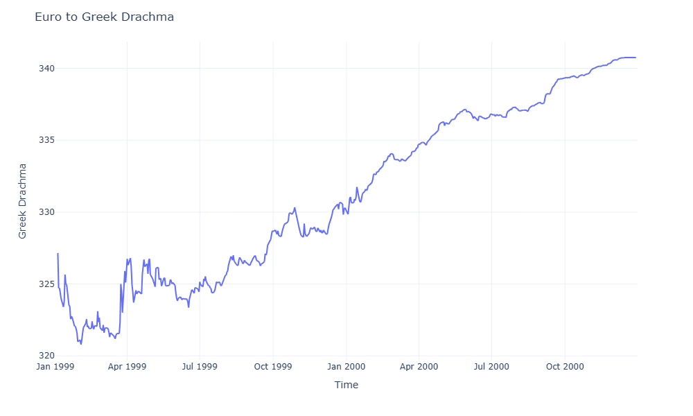

This jupyter notebook is about a dataset I found from Kaggle(link: https://www.kaggle.com/datasets/lsind18/euro-exchange-daily-rates-19992020 ), and I did some visualizations using Plotly library.

Here are the visualizations:

- Euro to drachma

- Euro to drachma - Rolling Window Analysis
.png)
