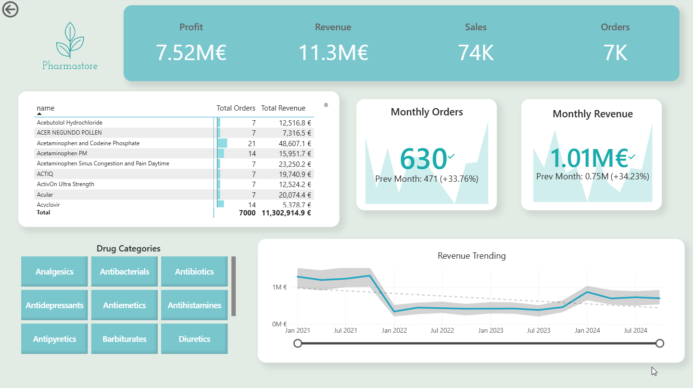
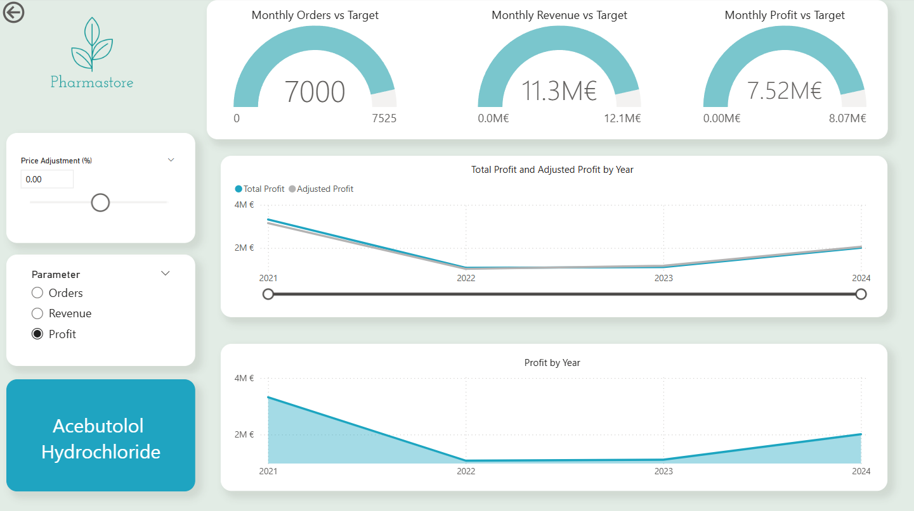
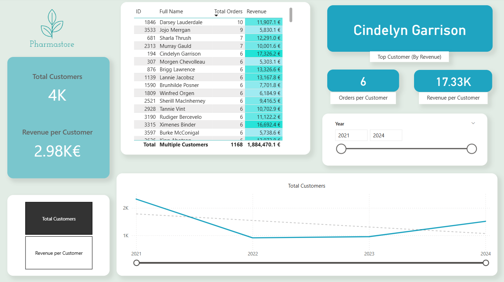

## Pharmastore analysis project

A data analysis project using SQL language and Power BI for visualization. 

It analyses the sales of an online pharmacy store in the period of 2021-2024
Some of the queries are referring to: 
- What is the most selling product line?
- Which product line generated the highest revenue?
- Which drug(or drugs) had the most sales
- How many times has a customer made an order, and which category
- Which category had the most sales

I also created some triggers to update some table fields automatically instead of manually

There is also a document with the software specification and some diagrams. 

***The analysis report includes 3 dashboards***: 

✅**The main dashboard**: including basic metrics and the trends of the period 2021-2024
  
  
✅**The Product Retail dashboard**: including metrics depending on parameters such as orders or profit  

✅**The Customer Detail dashboard**: including metrics about customers' orders and revenue 

 

