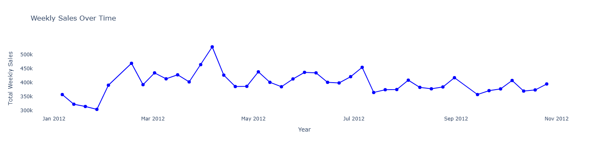
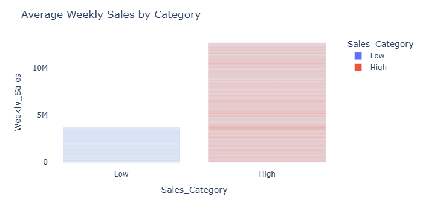
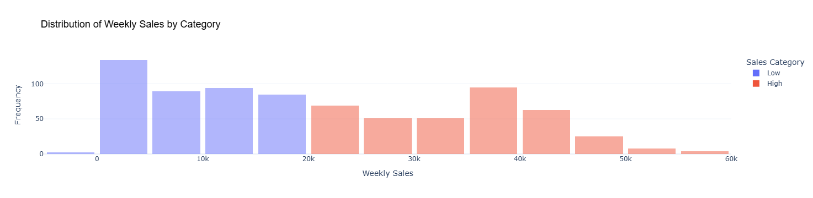

This is the final assignment of Workearly's boot camp, using Python and Matplotlib. 
The data are from Walmart and they represent the annual sales of 2012. 
The goal is to categorize and understand sales performance over time, helping guide future marketing and operational decisions.

**Weekly Sales Over Time**

**Average Weekly Sales by Category**

**Distribution of Weekly Sales by Category**

